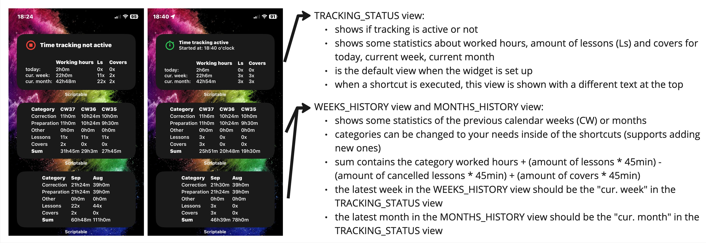
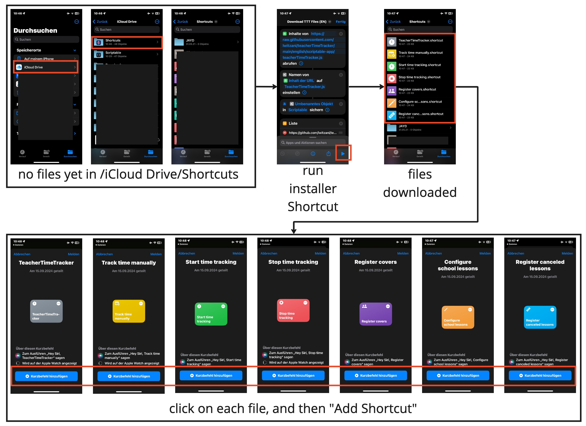
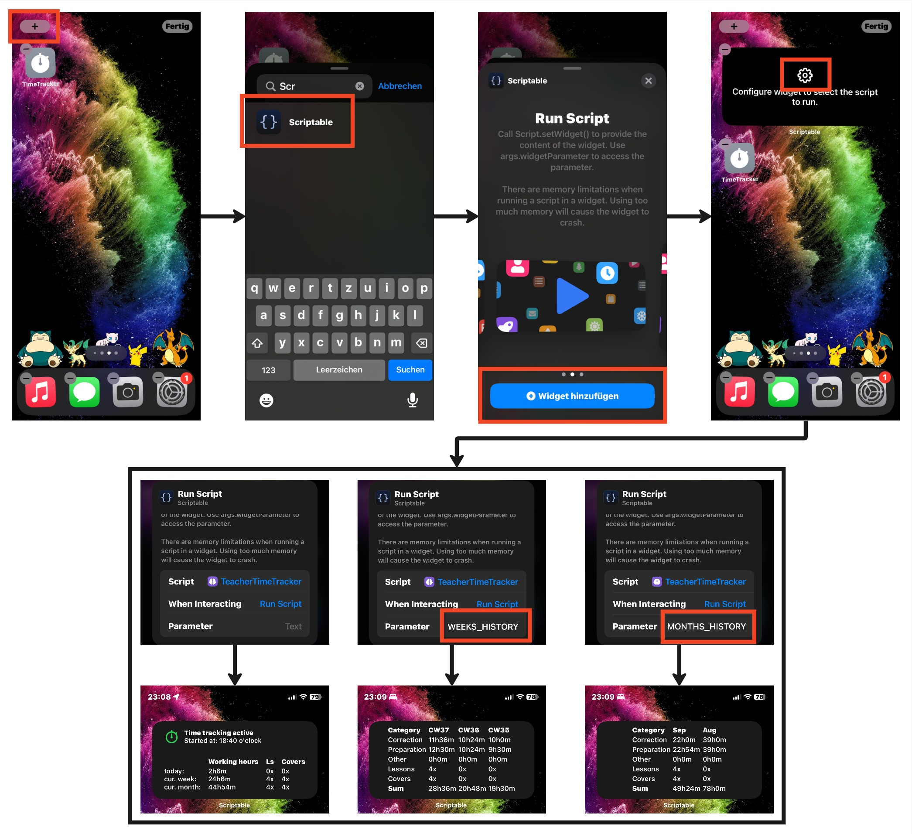
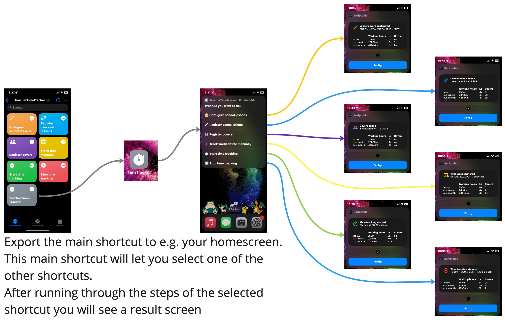
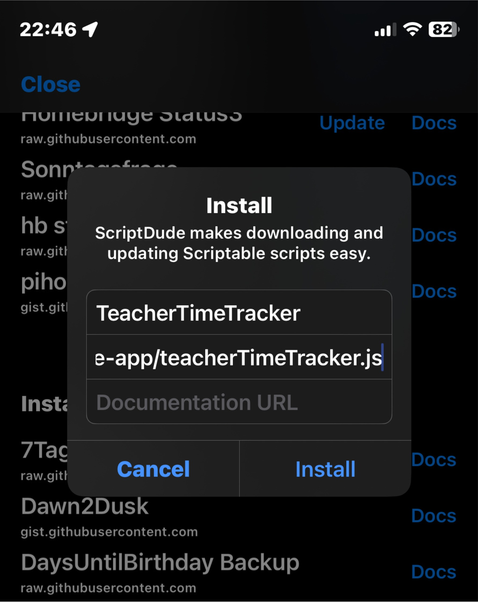

# TeacherTimeTracker
This repository contains a script for the iOS app "Scriptable" and several shortcut-files that work with the iOS app "Shortcuts".
Together, these files create a functional way of tracking worked hours. 
The script is meant for teachers to see their total hours worked.

# Disclaimer
- this script was created for one person that came to me asking for "something to track the time she is working for her teacher job" ... "existing apps cost something or are not really what she needs"
- features have not yet been tested over a larger period of time

# Features
- track worked hours
  - a category is chosen for each tracked duration
  - default categories: Correction, Preparation, Others
  - can be done via "start at point of time A and stop at point of time B" mechanism
  - can be done via "enter timespan" mechanism
- track covers (cover = when a teacher takes over a lesson from another teacher)
- track canceled lessons (when a teacher's lesson did not take place)
- see the amount of lessons you held
  - for this it is needed to enter the amount of own lessons (basically your schedule) for each weekday and the start and end date where lessons happen
  - held lessons are then calculated for each week/month
  - to have a somehow correct value here, you need to enter "canceled lessons" manually (e.g. on a national holiday)
- see a sum of worked hours based on a week or month view
  - worked hours are based on the worked hours in the different categories, the done covers, the done lessons, and the own cancelled lessons

# General description of setup
- the functionality is achieved using two iOS apps: Scriptable and Shortcuts
- Shortcuts are used to get user input
  - currently, 7 shortcuts exist and are needed to be installed
- Shortcuts will provide parameter to the Scriptable script
- the Scriptable script reacts on the parameter coming from Shortcuts and handles the saving and displaying of the information
- the Scriptable script can be set up as widgets on the homescreen of iOS

# Before the set up
- have Scriptable downloaded on your iOS device
- have Apple's Shortcut app on you iOS device
- iCloud is used in this setup so without you will get errors

# How to get the files
- choose your preferred language (english or german) and get the installer Shortcut in your Shortcuts app by clicking one of the links below
  - english: https://www.icloud.com/shortcuts/190a38b1493f484cbf4437cc2d54c09f
  - german: https://www.icloud.com/shortcuts/1d02cd443ad9447ab599615db447e923
- execute the installer Shortcut (this will just download the files and put them into the right iCloud folder)
  - the Scriptable script is now already ready
  - the Shortcut files are in the right folder but are not visible in the Shortcut app yet
- find your "Files" app on iOS and go to /iCloud Drive/Shortcuts
  - here on top you should see 7 new shortcuts
- click on each of those 7 files once, and you will be asked to add them to your Shortcuts app
  - click "Add Shortcut" for each of them (now they will be visible inside the app)

# How to set up the widget
- e.g. on your device's homescreen, add a new widget and choose the type "Scriptable"
- add the medium variant
- configure the widget to show the script and for the action select "run script"
- 3 different views can be set up by providing widget parameters in this view
  - leave it blank for the TRACKING_STATUS view
  - enter WEEKS_HISTORY to get the view on statistics based on weeks
  - enter MONTHS_HISTORY to get the view on statistics based on months

# Using the main Shortcut
- you basically only need one of the added Shortcuts, the one named TeacherTimeTracker
- this one will give you the list of possible functions and internally just references all the other added Shortcuts
- you can export the main Shortcut to for example your homescreen then it looks like an own app and it doesn't open the Shortcuts app when executing

# Please note
- when you run the shortcuts the first time you will be asked to "allow" different things like accessing Scriptable scripts out of Shortcuts
- just hit "allow" or "ok" for whatever pops up

# Shortcut explanations
- Configure school lessons
  - this shortcut should be executed once directly after setting everything up
  - you will be asked to input
    - the amount of lessons you usually hold on each weekday
    - the first & last day of lessons in the current school year
  - this information will be used to calculate how many lessons you held
- Register canceled lessons
  - everytime you did not hold your any of your lesson, you should use this shortcut to register this
  - also, when you had a national holiday on which you did not hold your lessons, you should enter those with this shortcut
  - you will be asked to input
    - an amount of lessons that were canceled
    - a date on which the lessons were cancelled
- Register covers
  - everytime you cover a lesson for another teacher you should use this shortcut to register this
  - you will be asked to input
    - an amount of lessons that you covered
    - a date on which you covered the lessons
- Track time manually
  - use this if you want to track worked hours in the past
  - you will be asked to input
    - the worked hours you want to track
    - the date on which you worked those hours
    - the category that those hours should be mapped to
- Start time tracking
  - use this shortcut before you start working to start the timer
- Stop time tracking
  - use this shortcut after you worked (when you obviously started the timer with the previous shortcut first)
  - you will be asked to input the category that the worked hours should be mapped to
  - there is an option to discard the tracked time, then only the timer is stopped

# Customizations
- you can add new categories in the shortcuts
  - the Scriptable script can handle new categories out of the box
  - if you want to remove a category again, you need to delete it from the json file
- most of the variables at the top of the Scriptable script can be adapted by you
- you can add your own language by editing the translation object in the Scriptable script and switching out the according texts in all the Shortcuts
- you can change variables to show lessons and covers as hours instead of an amount
  - use variables displayLessonsAs and displayCoversAs with values 'COUNT' or 'HOURS' for that
- you can set your own widget color and text color if you want
- if lessons in your country do not last 45min then adapt the variable lessonRealHours

# How to fix wrong trackings or a broken state
- everything is saved in a json file called TeacherTimeTracker.json in /iCloud Drive/Scriptable folder
  - you can always modify this file manually (if you know what you do) to correct things
- if e.g. wrong covers were added, you can actually correct those cases via the given Shortcuts by using negative numbers

# manual set up (without installer Shortcut)
- of course if you know what you do you can also use the Scriptdu.de script together with the raw link and the name TeacherTimeTracker to install the script
  - important: it really must be exactly the name "TeacherTimeTracker" because the Shortcuts will reference a script with this name

- for the shortcuts, you need to download them manually from this repository and open them once, one by one

